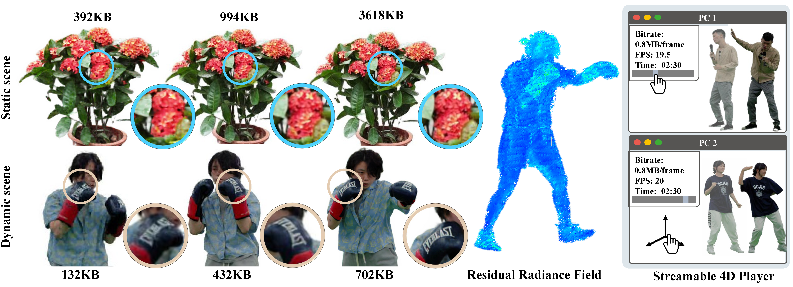

# ReRF: Neural Residual Radiance Fields for Streamably Free-Viewpoint Videos
PyTorch implementation of paper "Neural Residual Radiance Fields for Streamably Free-Viewpoint Videos", CVPR 2023.

> Neural Residual Radiance Fields for Streamably Free-Viewpoint Videos   
> [Liao Wang](https://aoliao12138.github.io/), [Qiang Hu](https://sist.shanghaitech.edu.cn/2020/0706/c7494a53788/page.htm), 
>[Qihan He](https://www.linkedin.com/in/qihan-he-a378a61b7/), Ziyu Wang, [Jingyi Yu](https://sist.shanghaitech.edu.cn/2020/0707/c7499a53862/page.htm),
>[Tinne Tuytelaars](https://homes.esat.kuleuven.be/~tuytelaa/), [Lan Xu](https://www.xu-lan.com/index.html), [Minye Wu](https://wuminye.com/)  
> CVPR 2023
> 

#### [project page](https://aoliao12138.github.io/ReRF/) | [paper](https://arxiv.org/abs/2304.04452) | [data & model](https://drive.google.com/drive/folders/1nIl3wmbp10eN0X6z5W04GIZa1MNLv7i8?usp=sharing)



# Installation

```bash
git clone git@github.com:aoliao12138/ReRF.git
cd ReRF
conda env create -f environment.yml
conda activate rerf
pip install torch==1.12.1+cu116 torchvision==0.13.1+cu116 torchaudio==0.12.1 --extra-index-url https://download.pytorch.org/whl/cu116
pip install torch-scatter==2.0.9
```
Tested on Ubuntu with RTX 3090.

# Datasets
Follow [ReRF_Dataset](https://github.com/aoliao12138/ReRF_Dataset) to download our dataset and model. It is only for non-commercial purposes.
To use our data for training and rendering, for example, first unzip it to your data folder and run:
```bash
$ python data_util.py --dataset_dir ./data/kpop
```

## Get Started
You can **use, redistribute, and adapt** the material for **non-commercial purposes**, as long as you give appropriate credit by **citing our paper** and **indicating any changes** that you've made.

### Train
To train `kpop` scene, run:
```bash
$ python run.py --config configs/rerf/kpop.py --render_test
```

### Compression
Compress each trained frames
```bash
$ LD_LIBRARY_PATH=./ac_dc:$LD_LIBRARY_PATH PYTHONPATH=./ac_dc/:$PYTHONPATH python codec/compress.py --model_path ./output/kpop  --frame_num 4000 --expr_name rerf
```
Use `--pca` to enable pca and `--group_size` to enable GOF compression.


### Rendering
render video while camera and frames are changing, run:
```bash
$ LD_LIBRARY_PATH=./ac_dc:$LD_LIBRARY_PATH PYTHONPATH=./ac_dc/:$PYTHONPATH python rerf_render.py --config ./configs/rerf/kpop.py --compression_path ./output/kpop/rerf  --render_360 4000
```
If your compression use `--pca` or `--group_size`, you need to also set them at the rendering

Follow [ReRF_Dataset](https://github.com/aoliao12138/ReRF_Dataset) to download our compressed files for the scene kpop. It contains 4000 frames. You can unzip it and render it by using 
```bash
LD_LIBRARY_PATH=./ac_dc:$LD_LIBRARY_PATH PYTHONPATH=./ac_dc/:$PYTHONPATH python rerf_render.py --config ./configs/rerf/kpop.py --compression_path <the folder path you unzip>  --render_360 4000 --pca --group_size 20
```


### Your own config files
As [DVGO](https://github.com/sunset1995/DirectVoxGO), check the comments in [`configs/default.py`](./configs/default.py) for the configurable settings.
We use [`mmcv`'s config system](https://mmcv.readthedocs.io/en/latest/understand_mmcv/config.html).
To create a new config, please inherit `configs/default.py` first and then update the fields you want.
As [DVGO](https://github.com/sunset1995/DirectVoxGO), you can change some settings like `N_iters`, `N_rand`, `num_voxels`, `rgbnet_depth`, `rgbnet_width` and so on to achieve the speed and quality tradeoff.
### Extention to new dataset

The scale of the bbox will greatly affect the final result, so it is recommended to adjust it to fit your camera coordinate system.
You can follow [DVGO](https://github.com/sunset1995/DirectVoxGO#:~:text=Extention%20to%20new%20dataset) to adjust it.

## Acknowledgement
The code base is originated from the [DVGO](https://github.com/sunset1995/DirectVoxGO) implementation. We borrowed some codes from [Multi-view Neural Human Rendering (NHR)](https://github.com/wuminye/NHR) and [torch-dct](https://github.com/jbojar/torch-dct).

## Citation
```
@InProceedings{Wang_2023_CVPR,
    author    = {Wang, Liao and Hu, Qiang and He, Qihan and Wang, Ziyu and Yu, Jingyi and Tuytelaars, Tinne and Xu, Lan and Wu, Minye},
    title     = {Neural Residual Radiance Fields for Streamably Free-Viewpoint Videos},
    booktitle = {Proceedings of the IEEE/CVF Conference on Computer Vision and Pattern Recognition (CVPR)},
    month     = {June},
    year      = {2023},
    pages     = {76-87}
}
```


